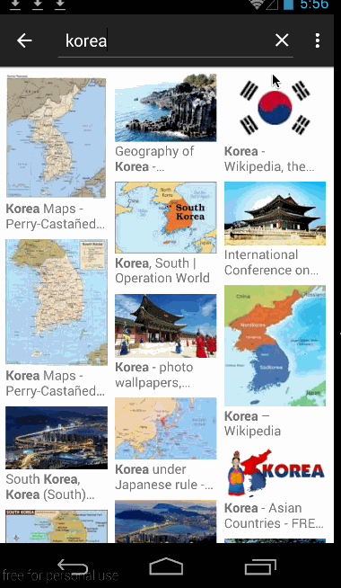

# GridImageSearch

This is my implementation of the GridImageSearch that's described here: http://courses.codepath.com/courses/intro_to_android/week/2#!assignment

Time spent: 6 hours spent in total

Completed user stories:

  * [x] User can enter a search query that will display a grid of image results from the Google Image API.
  * [x] User can click on "settings" which allows selection of advanced search options to filter results
  * [x] User can configure advanced search filters
  * [x] Subsequent searches will have any filters applied to the search results
  * [x] User can tap on any image in results to see the image full-screen
  * [x] User can scroll down “infinitely” to continue loading more image results (up to 8 pages)

Extensions:

 * [x] Advanced: Use the ActionBar SearchView or custom layout as the query box instead of an EditText
 * [x] Advanced: User can share an image to their friends or email it to themselves
 * [x] Advanced: Replace Filter Settings Activity with a lightweight modal overlay
 * [x] Advanced: Improve the user interface and experiment with image assets and/or styling and coloring
 * [x] Bonus: Use the StaggeredGridView to display improve the grid of image results

Walkthrough of all user stories:

GIF created with [LiceCap](http://www.cockos.com/licecap/).

